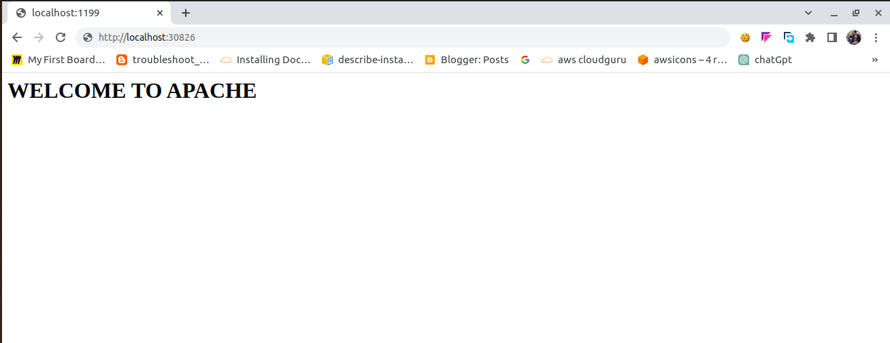
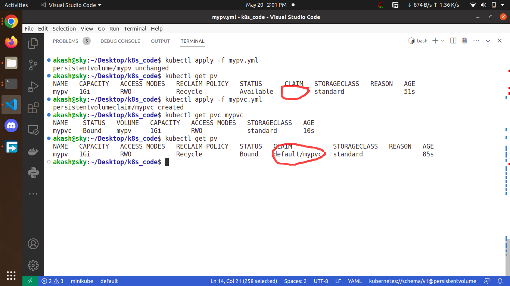

## minikube install for linux
```
curl -LO https://storage.googleapis.com/minikube/releases/latest/minikube-linux-amd64
```
```
sudo install minikube-linux-amd64 /usr/local/bin/minikube
```

## for mac
```
curl -LO https://storage.googleapis.com/minikube/releases/latest/minikube-darwin-amd64
sudo install minikube-darwin-amd64 /usr/local/bin/minikube


```
### create pod using kubectl run 
```
akash@sky:~/Desktop/k8s_code$ kubectl run myprpod --image aakashgaur57/xyz --port 80 --dry-run=client -o yaml 
apiVersion: v1
kind: Pod
metadata:
  creationTimestamp: null
  labels:
    run: myprpod
  name: myprpod
spec:
  containers:
  - image: aakashgaur57/xyz
    name: myprpod
    ports:
    - containerPort: 80
    resources: {}
  dnsPolicy: ClusterFirst
  restartPolicy: Always
status: {}
```

```
akash@sky:~$ kubectl get po
NAME    READY   STATUS    RESTARTS      AGE
akpod   1/1     Running   1 (39m ago)   10h
akash@sky:~$ kubectl get po -o wide
NAME    READY   STATUS    RESTARTS      AGE   IP              NODE       NOMINATED NODE   READINESS GATES
akpod   1/1     Running   1 (39m ago)   10h   10.244.120.96   minikube   <none>           <none>


```

### types of secrets 
```
  docker-registry   Create a secret for use with a Docker registry
  generic           Create a secret from a local file, directory, or literal value
  tls               Create a TLS secret

```
### create docker-registry secrets  --dry-run
````
akash@sky:~/Desktop/k8s_code$ kubectl create secret docker-registry my-cred --docker-server=docker.io --docker-username=aakashgaur57 --docker-password="xyz@" --dry-run=client -o yaml 
apiVersion: v1
data:
  .dockerconfigjson: eyJhdXRocyI6eyJkb2NrZXIuaW8iOnsidXNlcm5hbWUiOiJhYWthc2hnYXVyNTciLCJwYXNzd29yZCI6Inh5ekAiLCJhdXRoIjoiWVdGcllYTm9aMkYxY2pVM09uaDVla0E9In19fQ==
kind: Secret
metadata:
  creationTimestamp: null
  name: my-cred
type: kubernetes.io/dockerconfigjson
````
### to create a yaml file of secret
```
kubectl create secret docker-registry my-cred --docker-server=docker.io --docker-username=aakashgaur57 --docker-password="xyz@" --dry-run=client -o yaml >my-cred.yml
```
### run yaml of secret 
```
akash@sky:~/Desktop/k8s_code$kubectl apply -f my-cred.yml
akash@sky:~/Desktop/k8s_code$ kubectl get secrets 
NAME      TYPE                             DATA   AGE
my-cred   kubernetes.io/dockerconfigjson   1      7h58m
```
### 15may history
```
 1939  kubectl get nodes 
 1941  kubectl get po
 1942  kubectl get no
 1943  kubectl api-resources 
 akash@sky:~/Desktop/k8s_code$ kubectl api-resources 
NAME                              SHORTNAMES   APIVERSION                             NAMESPACED   KIND
bindings                                       v1                                     true         Binding
componentstatuses                 cs           v1                                     false        ComponentStatus
configmaps                        cm           v1                                     true         ConfigMap
endpoints                         ep           v1                                     true         Endpoints
events                            ev           v1                                     true         Event
limitranges                       limits       v1                                     true         LimitRange
namespaces                        ns           v1                                     false        Namespace
nodes                             no           v1                                     false        Node
persistentvolumeclaims            pvc          v1                                     true         PersistentVolumeClaim
persistentvolumes                 pv           v1                                     false        PersistentVolume
pods                              po           v1                                     true         Pod
podtemplates                                   v1                                     true         PodTemplate
replicationcontrollers            rc           v1                                     true         ReplicationController
resourcequotas                    quota        v1                                     true         ResourceQuota
secrets                                        v1                                     true         Secret

 
 1945  kubectl run mypo --image httpd --port 80 --dry-run=client -o yaml
 1946  kubectl run mypo --image httpd --port 80 --dry-run=client -o yaml >newpod.yml
 1949  kubectl describe po akpod 
 1953  kubectl get namespaces
 
 akash@sky:~/Desktop/k8s_code$ kubectl get namespaces
NAME                   STATUS   AGE
default                Active   2d14h
kube-node-lease        Active   2d14h
kube-public            Active   2d14h
kube-system            Active   2d14h

 1954  kubectl get pods -n kube-system 
 akash@sky:~/Desktop/k8s_code$  kubectl get pods -n kube-system 
NAME                                      READY   STATUS    RESTARTS        AGE
calico-kube-controllers-7bdbfc669-gvmk7   1/1     Running   3 (6h59m ago)   2d14h
calico-node-kgfdk                         1/1     Running   1 (6h59m ago)   11h
calico-node-nhs5f                         1/1     Running   3 (6h59m ago)   2d14h
coredns-787d4945fb-nc4jw                  1/1     Running   3 (6h59m ago)   2d14h
etcd-minikube                             1/1     Running   3 (6h59m ago)   2d14h
kube-apiserver-minikube                   1/1     Running   3 (67m ago)     2d14h
kube-controller-manager-minikube          1/1     Running   3 (6h59m ago)   2d14h
kube-proxy-4xhmg                          1/1     Running   3 (6h59m ago)   2d14h
kube-proxy-n6f8w                          1/1     Running   1 (6h59m ago)   11h
kube-scheduler-minikube                   1/1     Running   3 (6h59m ago)   2d14h
storage-provisioner                       1/1     Running   6 (66m ago)     2d14h

 1955  kubectl get pods -n kube-system  -o wide
 1956  kubectl get  po --all-namespaces 
 akash@sky:~/Desktop/k8s_code$ kubectl get  po --all-namespaces 
NAMESPACE              NAME                                        READY   STATUS      RESTARTS        AGE
default                akpod                                       1/1     Running     1 (67m ago)     11h
kube-system            calico-node-nhs5f                           1/1     Running     3 (6h59m ago)   2d14h
kube-system            coredns-787d4945fb-nc4jw                    1/1     Running     3 (6h59m ago)   2d14h
kube-system            etcd-minikube                               1/1     Running     3 (6h59m ago)   2d14h
kube-system            kube-apiserver-minikube                     1/1     Running     3 (67m ago)     2d14h
kube-system            kube-controller-manager-minikube            1/1     Running     3 (6h59m ago)   2d14h
kube-system            kube-proxy-4xhmg                            1/1     Running     3 (6h59m ago)   2d14h
kube-system            kube-proxy-n6f8w                            1/1     Running     1 (6h59m ago)   11h
kube-system            kube-scheduler-minikube                     1/1     Running     3 (6h59m ago)   2d14h
kube-system            storage-provisioner                         1/1     Running     6 (66m ago)     2d14h

 
 1957  kubectl get  po -A
 1959  docker ps
 1960  docker exec -it minikube bash
 1965  kubectl get ns
 1966  kubectl get po -n kube-system 
 1967  kubectl get  node
 1968  kubectl get po -n kube-system -o wide
 1969  kubectl get po
 1970  kubectl get po -o wide
```
### for dashboard
#### run in powershell or terminal
```
kubectl apply -f https://raw.githubusercontent.com/Gaur95/for_docker_desktop/kubernetes/dashboard.yml

```
```
akash@sky:~/Desktop/k8s_code$ kubectl proxy 
Starting to serve on 127.0.0.1:8001

```
#### run in web browser
```
http://localhost:8001/api/v1/namespaces/kubernetes-dashboard/services/https:kubernetes-dashboard:/proxy/

```
### create a token
+ kubectl create token <service_account_name> -n <namespace_name>
```
kubectl create token kubernetes-dashboard -n kubernetes-dashboard
```
```
akash@sky:~$ kubectl create token  kubernetes-dashboard -n kubernetes-dashboard
eyJhbGciOiJSUzI1NiIsImtpZCI6IlJsc0NHTjVxeWNKNk1IWkxMdkVZUVpmLVdxUC1VUWxXMVE3TUlwN
ncwZWcifQ.eyJhdWQiOlsiaHR0cHM6Ly9rdWJlcm5ldGVzLmRlZmF1bHQuc3ZjLmNsdXN0ZXIubG9jYWw
iXSwiZXhwIjoxNjg0MzUwOTQxLCJpYXQiOjE2ODQzNDczNDEsImlzcyI6Imh0dHBzOi8va3ViZXJuZXRl
cy5kZWZhdWx0LnN2Yy5jbHVzdGVyLmxvY2FsIiwia3ViZXJuZXRlcy5pbyI6eyJuYW1lc3BhY2UiOiJkZ
WZhdWx0Iiwic2VydmljZWFjY291bnQiOnsibmFtZSI6ImRlZmF1bHQiLCJ1aWQiOiI2MTE5ZmU1ZC02M2
UxLTQ4MmYtYTEyMS0xZmVmZmY5M2EyMzkifX0sIm5iZiI6MTY4NDM0NzM0MSwic3ViIjoic3lzdGVtOnN
lcnZpY2VhY2NvdW50OmRlZmF1bHQ6ZGVmYXVsdCJ9.hrVEJTRzPPRftt0nVqH5czX6oZMn-q4I
```
+ copy token in to dashboard login 

### may18 create raplicationcontroller
### yaml of replicationcontroller
```
apiVersion: v1
kind: ReplicationController
metadata:
  name: mypod99
spec:
  replicas: 2
  selector:
    color: blue
  template:
    metadata:
      name: mypod99
      labels:
        color: blue
    spec:
      containers:
        - name: mypod99
          image: httpd
          ports:
            - containerPort: 80
 ```
 ### history
 ```
akash@sky:~/Desktop/k8s_code$ kubectl apply -f replica.yml 
replicationcontroller/mypod99 configured
akash@sky:~/Desktop/k8s_code$ kubectl get rc
NAME      DESIRED   CURRENT   READY   AGE
mypod99   2         2         2       11h
akash@sky:~/Desktop/k8s_code$ kubectl get po
NAME            READY   STATUS    RESTARTS      AGE
mypod99-l4ksm   1/1     Running   0             80m
mypod99-r7qt4   1/1     Running   1 (80m ago)   11h
akash@sky:~/Desktop/k8s_code$ kubectl get po --show-labels 
NAME            READY   STATUS    RESTARTS      AGE   LABELS
mypod99-l4ksm   1/1     Running   0             80m   color=blue
mypod99-r7qt4   1/1     Running   1 (81m ago)   11h   color=blue
akash@sky:~/Desktop/k8s_code$ kubectl delete po mypod99-l4ksm
pod "mypod99-l4ksm" deleted
akash@sky:~/Desktop/k8s_code$ kubectl get po --show-labels 
NAME            READY   STATUS              RESTARTS      AGE   LABELS
mypod99-jmfwr   0/1     ContainerCreating   0             4s    color=blue
mypod99-r7qt4   1/1     Running             1 (81m ago)   11h   color=blue
akash@sky:~/Desktop/k8s_code$ kubectl delete rc mypod99 
replicationcontroller "mypod99" deleted
```
### deploy
```
akash@sky:~/Desktop/k8s_code$ kubectl apply -f deploy.yml 
deployment.apps/jecrcdep unchanged
akash@sky:~/Desktop/k8s_code$ kubectl get deploy
NAME       READY   UP-TO-DATE   AVAILABLE   AGE
jecrcdep   3/3     3            3           3m15s
akash@sky:~/Desktop/k8s_code$ kubectl get po
NAME                       READY   STATUS    RESTARTS   AGE
jecrcdep-c95bcf94f-s6t9b   1/1     Running   0          3m20s
jecrcdep-c95bcf94f-w4497   1/1     Running   0          3m20s
jecrcdep-c95bcf94f-zltgf   1/1     Running   0          3m20s
akash@sky:~/Desktop/k8s_code$ kubectl get pod --show-labels 
NAME                       READY   STATUS    RESTARTS   AGE     LABELS
jecrcdep-c95bcf94f-s6t9b   1/1     Running   0          3m30s   color=red,pod-template-hash=c95bcf94f
jecrcdep-c95bcf94f-w4497   1/1     Running   0          3m30s   color=red,pod-template-hash=c95bcf94f
jecrcdep-c95bcf94f-zltgf   1/1     Running   0          3m30s   color=red,pod-template-hash=c95bcf94f
akash@sky:~/Desktop/k8s_code$ kubectl get po -o wide
NAME                       READY   STATUS    RESTARTS   AGE     IP               NODE           NOMINATED NODE   READINESS GATES
jecrcdep-c95bcf94f-s6t9b   1/1     Running   0          3m49s   10.244.205.243   minikube-m02   <none>           <none>
jecrcdep-c95bcf94f-w4497   1/1     Running   0          3m49s   10.244.205.244   minikube-m02   <none>           <none>
jecrcdep-c95bcf94f-zltgf   1/1     Running   0          3m49s   10.244.120.106   minikube       <none>           <none>
akash@sky:~/Desktop/k8s_code$ 
```
### SERVICE (k8s Networking)
https://github.com/Gaur95/for_docker_desktop/blob/kubernetes/k8s_networking.pdf
+ yaml of Nodeport service:- 
```
apiVersion: v1
kind: Service
metadata:
  name: mysvc11
spec:
  type: NodePort
  selector:
    color: red
  ports:
  - port: 1144
    targetPort: 80

```
+ yaml of pod which connet to that service(NodePort)
```
apiVersion: v1
kind: Pod
metadata:
  name: xyz
  labels:
    color: red
spec:
  containers:
  - name: xyz
    image: aakashgaur57/akweb
    ports:
      - containerPort: 80
 ```
 ```
akash@sky:~/Desktop/k8s_code$ kubectl apply -f pod.yml 
pod/xyz created
akash@sky:~/Desktop/k8s_code$ kubectl get po xyz --show-labels 
NAME   READY   STATUS    RESTARTS   AGE   LABELS
xyz    1/1     Running   0          21s   color=red
```
```
akash@sky:~/Desktop/k8s_code$ kubectl apply -f mysvc.yml 
service/mysvc11 created
akash@sky:~/Desktop/k8s_code$ kubectl get svc mysvc11 -o wide
NAME      TYPE       CLUSTER-IP      EXTERNAL-IP   PORT(S)          AGE   SELECTOR
mysvc11   NodePort   10.100.52.213   <none>        1144:30826/TCP   22s   color=red
akash@sky:~/Desktop/k8s_code$ curl localhost:30826
<h1>WELCOME TO APACHE</h1>
```


### if you are using minikube then use minikube IP and nodeport(30826)
```
akash@sky:~/Desktop/k8s_code$ minikube ip
192.168.49.2
```
### k8s Volumes
**emptyDir**: An emptyDir volume is created when a pod is scheduled and exists for the lifetime of that pod. It is initially empty and is useful for sharing files between containers within the same pod or storing temporary data. However, its contents are lost when the pod is deleted or restarted.

**hostPath**: The hostPath volume mounts a file or directory from the host node's filesystem into the pod. It allows containers to access files on the host machine, but it is not suitable for scenarios where pod mobility is required since the data is tied to a specific node. Using hostPath requires caution as it grants access to the host's filesystem.

**ConfigMap**: A ConfigMap volume allows you to inject configuration files as key-value pairs into the pod. ConfigMaps can be used to store environment variables, configuration files, or any other non-sensitive data. The ConfigMap data is mounted into the pod as files or environment variables, providing easy access for the containers.

**Secret**: The Secret volume is similar to the ConfigMap volume, but it is designed specifically for storing sensitive information, such as passwords, API keys, or TLS certificates. Secrets are base64 encoded and can be mounted into a pod as files or exposed as environment variables, ensuring secure access to sensitive data.

**Persistentvolume(PV) and PersistentVolumeClaim (PVC)**: **PersistentVolume (PV)***: A PersistentVolume represents a piece of persistent storage in the cluster. It is a cluster-level resource that abstracts the underlying storage implementation, such as a network-attached disk or a cloud storage volume. PVs have a lifecycle independent of any specific pod and can be dynamically provisioned or statically created by a cluster administrator.
**A PersistentVolumeClaim** is used to request a persistent storage resource from a storage system. It provides a way to abstract the underlying storage implementation from the pod. A PersistentVolumeClaim can be dynamically provisioned by a storage class or statically bound to a pre-existing PersistentVolume. This type of volume is suitable for stateful applications that require data persistence.

**CSI Volumes**: Container Storage Interface (CSI) volumes enable the use of external storage systems that adhere to the CSI standard. CSI allows for the integration of various storage solutions into Kubernetes. With CSI volumes, you can use third-party storage systems, such as cloud providers' managed storage services or specialized storage hardware, to provide persistent storage to your pods.

## Demo of PV and PVC
### yaml of pv and pvc 
```
apiVersion: v1
kind: PersistentVolume
metadata:
  name: mypv
spec:
  capacity:
    storage: 1Gi
  volumeMode: Filesystem
  accessModes:
    - ReadWriteOnce
  persistentVolumeReclaimPolicy: Recycle
  storageClassName: standard
  hostPath:
    path: /data/mypv
 ```
 ```
 apiVersion: v1
kind: PersistentVolumeClaim
metadata:
  name: mypvc
spec:
  resources:
    requests:
      storage: 1Gi
  volumeMode: Filesystem
  accessModes:
    - ReadWriteOnce
  storageClassName: standard
 ```
 
 
### pod with pvc     --- yaml

```
apiVersion: v1
kind: Pod
metadata:
  name: akpod
  labels:
    name: kuch
spec:
  containers:
    - name: akc1
      image: httpd
      ports:
        - containerPort: 80
      volumeMounts:
        - mountPath: /var/www/html/
          name: my-pvc
  volumes:
    - name: my-pvc
      persistentVolumeClaim:
        claimName: mypvc
```
