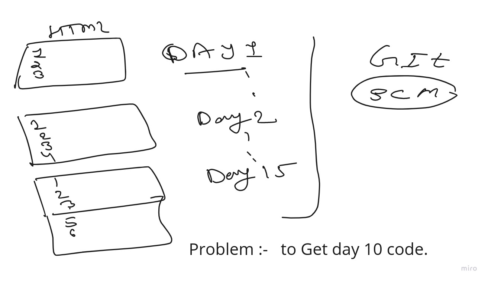

# GIT



### git in short
#### git clone
#### change in files
#### git add .
#### git commit -m "massage"
#### git push 
```
git version
  673  git clone https://github.com/Gaur95/test.git    --------> clone a repo from github 
  674  ls
  675  cd test/
  678  cat index.html 
  679  git branch 
  680  git switch mytestbranch  ------> to switch in another branch
  682  git switch main
  683  ls
  684  git branch 
  685  ls
  686  cat index.html 
  687  git pull            ------->  used to fetch and download content from a remote repository and immediately update the local repository to match that content
  688  cat index.html 
  689  ls
  690  ls -a
  691  cd .git/       
  692  ls
  693  cat config 
  694  cd ..
  695  ls
  696  git config 
  697  git config -l          ----> list of set configuration
  698  ls
  699  vim index.html 
  704  git add .
  706  git commit -m "add more"
  707  git config --global user.email "aakashgaur57.gmail.com"
  708  git config --global user.email "aakashgaur57@gmail.com"
  709  git config --global user.name "Gaur95"
  710  git commit -m "add more"
  711  git push 
```
### USE token instead of Password

