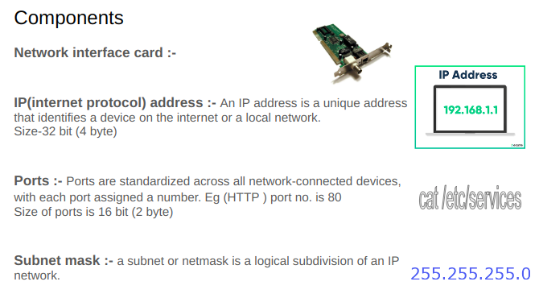
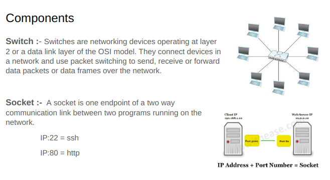
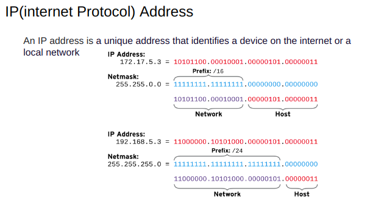
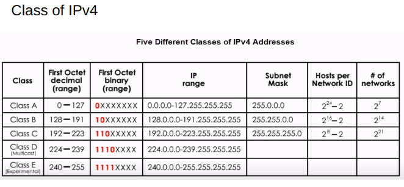

## Networking
## TCP Overview
### TCP(transmission control protocol):-
+ Connection oriented 
+ Reliable Protocol
+ Internet Engineering Task Force 
### UDP(User Datagram protocol)
+ Connectionless 
+ Unreliable Protocol

