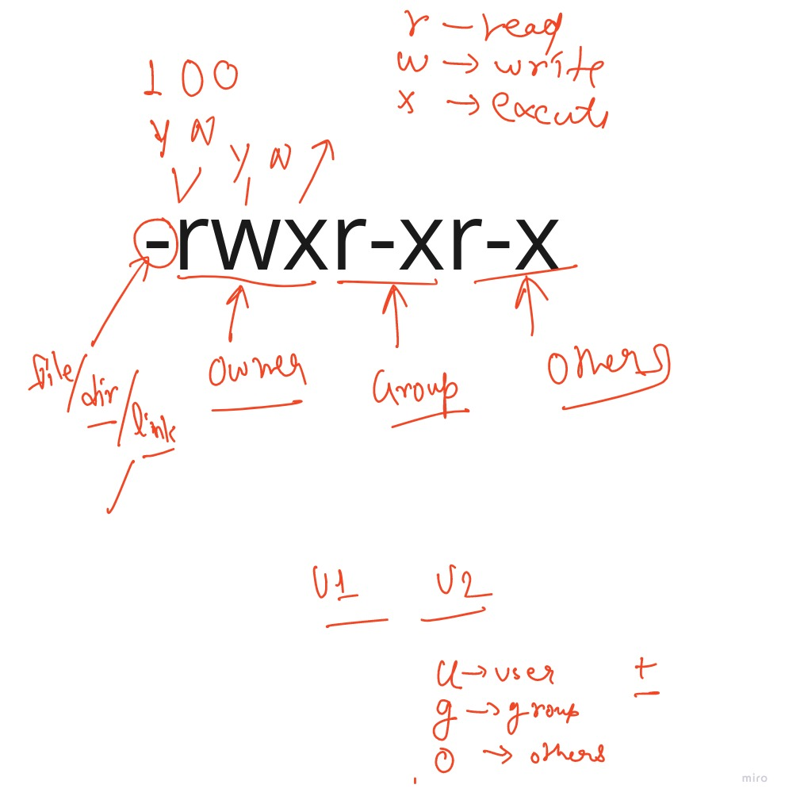
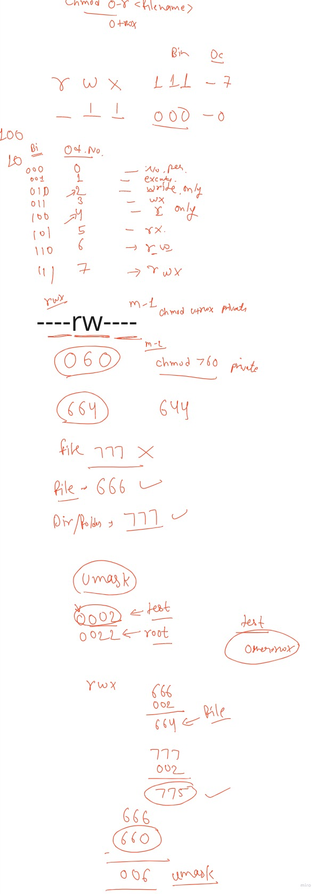
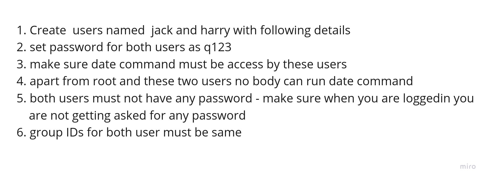

# for_docker_desktop

https://www.docker.com/products/docker-desktop 

https://learn.microsoft.com/en-us/windows/wsl/install-manual

# task for user management 
  1. Create an user named  test007 with following details
  2. set password for test007 user as LinuxLife
  3. for this user set alias of date command by the name of  mytime
  4. Alias must be permanent
  5. login from this user and run any two commands and store output in the output.txt under Desktop folder
  6. check userID for this user and change it to 3009
  

# task

