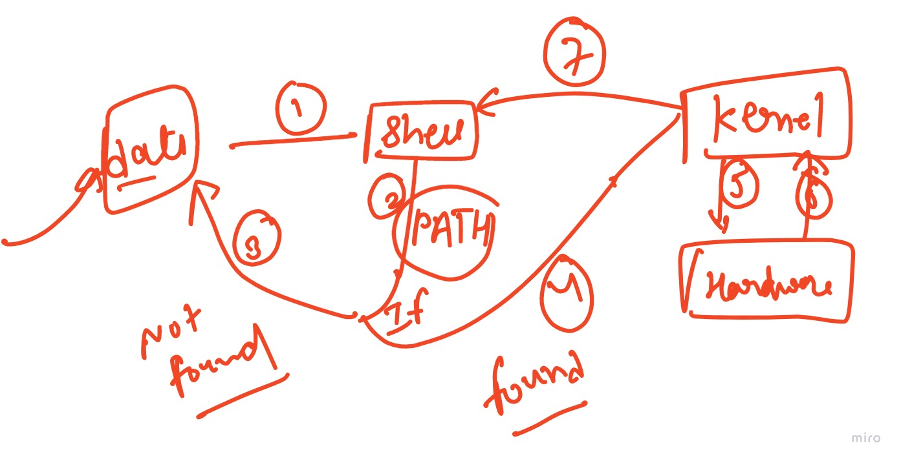
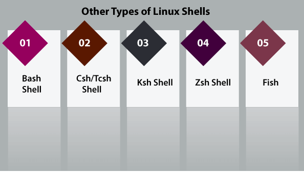
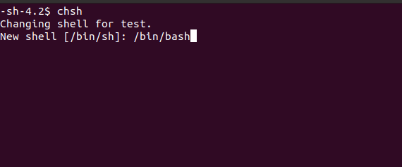
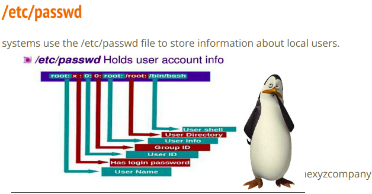
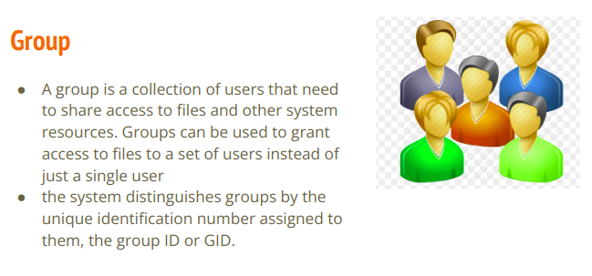
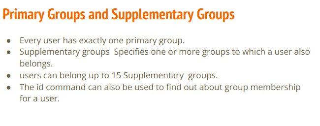
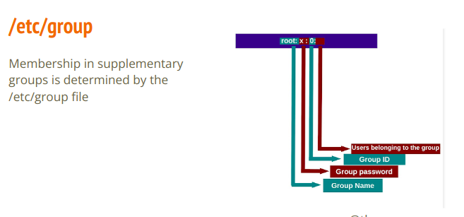
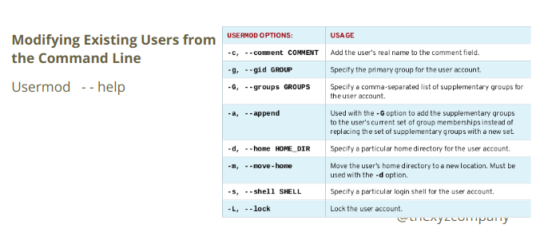
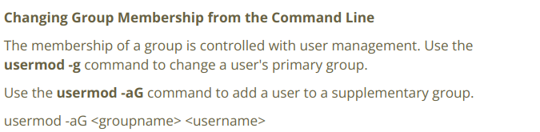

# for_docker_desktop

https://www.docker.com/products/docker-desktop 

https://learn.microsoft.com/en-us/windows/wsl/install-manual

# SHELL


## types of shell


## cmd
### chsh  --- to use change shell 


### cat /etc/shell      ---- to show all available shell
### echo $PATH          ----- instructs a Linux system in which directories to search for executables
### passwd              ----- to change user's password


# User managment 


### loaction of user's details 

```
cat /etc/passwd 
```


### Add User
adduser <username>
```
adduser hum
```
### Delete User
userdel <username> 

userdel -r <username>   ------------ also remove home directory of user
```
userdel -r hum
```

# group



## types of groups


## group details 
```
cat /etc/group
```


### for adding user in group




